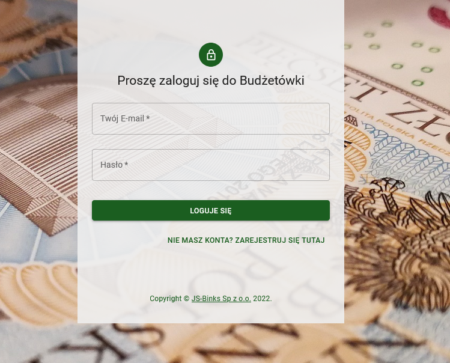
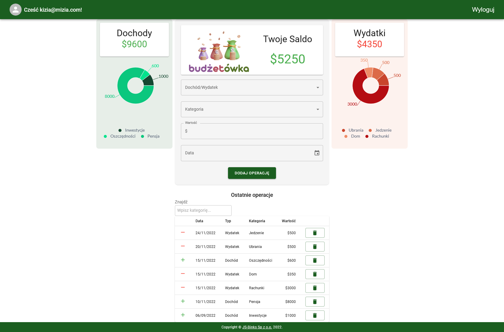

# Expense tracker application

Application created as a final group project within Bootcamp [Frontend with React in infoShare Academy](https://infoshareacademy.com/kurs/bootcamp-frontend/)

The following people worked on the application:

-   [Izabela Blinkiewicz](https://github.com/izamarciniak123)
-   [Bartłomiej Frąk](https://github.com/bartlomiej-fr)
-   [Andrzej Bułeczka](https://github.com/AndrzejBuleczka)
-   [Paweł Kenar](https://github.com/Pinkfloyd123)

Technologies used:

-   React z React Router
-   TypeScript
-   Firebase
-   Material UI

The application allows you to add income and expenses within customized categories, keeping the user updated on the current balance and graphically presenting expenses and income.

Simple login screen:

Main panel:

[Link to the application](https://budzetowka.netlify.app/)
